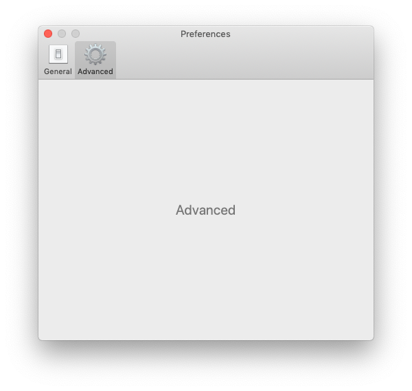

# Preferences

> Add a preferences window to your macOS app in minutes


Just pass in some view controllers and this package will take care of the rest.


## Requirements

- macOS 10.12+
- Xcode 10.2+
- Swift 5+


## Install

#### SwiftPM

```swift
.package(url: "https://github.com/sindresorhus/Preferences", from: "0.2.1")
```

#### Carthage

```
github "sindresorhus/Preferences"
```

#### CocoaPods

```ruby
pod 'Preferences'
```

<a href="https://www.patreon.com/sindresorhus">
	
</a>


## Usage

*Run the `PreferencesExample` target in Xcode to try a live example.*

First, create a collection of preference pane identifiers:

```swift
import Preferences

extension PreferencePaneIdentifier {
	static let general = PreferencePaneIdentifier("general")
	static let advanced = PreferencePaneIdentifier("advanced")
}
```

Second, create a couple of view controllers for the preference panes you want. The only difference from implementing a normal view controller is that you have to add the `PreferencePane` protocol and implement the `preferencePaneIdentifier`, `toolbarItemTitle`, and `toolbarItemIcon` properties, as shown below. You can leave out `toolbarItemIcon` if you're using the `.segmentedControl` style.

`GeneralPreferenceViewController.swift`

```swift
import Cocoa
import Preferences

final class GeneralPreferenceViewController: NSViewController, PreferencePane {
	let preferencePaneIdentifier = PreferencePaneIdentifier.general
	let preferencePaneTitle = "General"
	let toolbarItemIcon = NSImage(named: NSImage.preferencesGeneralName)!

	override var nibName: NSNib.Name? {
		return "GeneralPreferenceViewController"
	}

	override func viewDidLoad() {
		super.viewDidLoad()

		// Setup stuff here
	}
}
```

`AdvancedPreferenceViewController.swift`

```swift
import Cocoa
import Preferences

final class AdvancedPreferenceViewController: NSViewController, PreferencePane {
	let preferencePaneIdentifier = PreferencePaneIdentifier.advanced
	let preferencePaneTitle = "Advanced"
	let toolbarItemIcon = NSImage(named: NSImage.advancedName)!

	override var nibName: NSNib.Name? {
		return "AdvancedPreferenceViewController"
	}

	override func viewDidLoad() {
		super.viewDidLoad()

		// Setup stuff here
	}
}
```

In the `AppDelegate`, initialize a new `PreferencesWindowController` and pass it the view controllers. Then add an action outlet for the `Preferences…` menu item to show the preferences window.

`AppDelegate.swift`

```swift
import Cocoa
import Preferences

@NSApplicationMain
final class AppDelegate: NSObject, NSApplicationDelegate {
	@IBOutlet private var window: NSWindow!

	lazy var preferencesWindowController = PreferencesWindowController(
		preferencePanes: [
			GeneralPreferenceViewController(),
			AdvancedPreferenceViewController()
		]
	)

	func applicationDidFinishLaunching(_ notification: Notification) {}

	@IBAction
	func preferencesMenuItemActionHandler(_ sender: NSMenuItem) {
		preferencesWindowController.show()
	}
}
```

### Preferences Tab Styles

When you create the `PreferencesWindowController`, you can choose between the `NSToolbarItem`-based style (default) and the `NSSegmentedControl`:

```swift
// …
lazy var preferencesWindowController = PreferencesWindowController(
	preferencePanes: [
		GeneralPreferenceViewController(),
		AdvancedPreferenceViewController()
	],
	style: .segmentedControl
)
// …
```

`.toolbarItem` style:



`.segmentedControl` style:


## API

```swift
public protocol PreferencePane: AnyObject {
	var preferencePaneIdentifier: PreferencePaneIdentifier { get }
	var preferencePaneTitle: String { get }
	var toolbarItemIcon: NSImage { get } // Not required when using the .`segmentedControl` style
}

public enum PreferencesStyle {
	case toolbarItems
	case segmentedControl
}

public final class PreferencesWindowController: NSWindowController {
	init(
		preferencePanes: [PreferencePane],
		style: PreferencesStyle = .toolbarItems,
		animated: Bool = true,
		hidesToolbarForSingleItem: Bool = true
	)

	func show(preferencePane: PreferencePaneIdentifier? = nil)
}
```

As usual, call `NSWindowController#close()` to close the preferences window.


## FAQ

### How can I localize the window title?

The `PreferencesWindowController` adheres to the [Apple HIG](https://developer.apple.com/design/human-interface-guidelines/macos/app-architecture/preferences/) and uses this set of rules to determine the window title:

- **Multiple preference panes:** Uses the currently selected `preferencePaneTitle` as the window title. Localize your `preferencePaneTitle`s to get localized window titles.
- **Single preference pane:** Sets the window title to `APPNAME Preferences`. The app name is obtained from your app's bundle. You can localize its `Info.plist` to customize the title. The `Preferences` part is taken from the "Preferences…" menu item, see #12. The order of lookup for the app name from your bundle:
	1. `CFBundleDisplayName`
	2. `CFBundleName`
	3. `CFBundleExecutable`
	4. Fall back to `"<Unknown App Name>"` to show you're missing some settings.

### How is it better than [`MASPreferences`](https://github.com/shpakovski/MASPreferences)?

- Written in Swift. *(No bridging header!)*
- Swifty API using a protocol.
- Fully documented.
- The window title is automatically localized by using the system string.
- Supports segmented control style tabs.


## Related

- [Defaults](https://github.com/sindresorhus/Defaults) - Swifty and modern UserDefaults
- [LaunchAtLogin](https://github.com/sindresorhus/LaunchAtLogin) - Add "Launch at Login" functionality to your macOS app
- [DockProgress](https://github.com/sindresorhus/DockProgress) - Show progress in your app's Dock icon
- [More…](https://github.com/search?q=user%3Asindresorhus+language%3Aswift)

You might also like Sindre's [apps](https://sindresorhus.com/apps).


### Used in these app

- [TableFlip](https://tableflipapp.com/)
- [The Archive](https://zettelkasten.de/the-archive/)
- [Word Counter](https://wordcounterapp.com/)

Want to tell the world about your app using Preferences? Open a PR!


## Maintainers

- [Sindre Sorhus](https://github.com/sindresorhus)
- [Christian Tietze](https://github.com/DivineDominion)


## License

MIT
